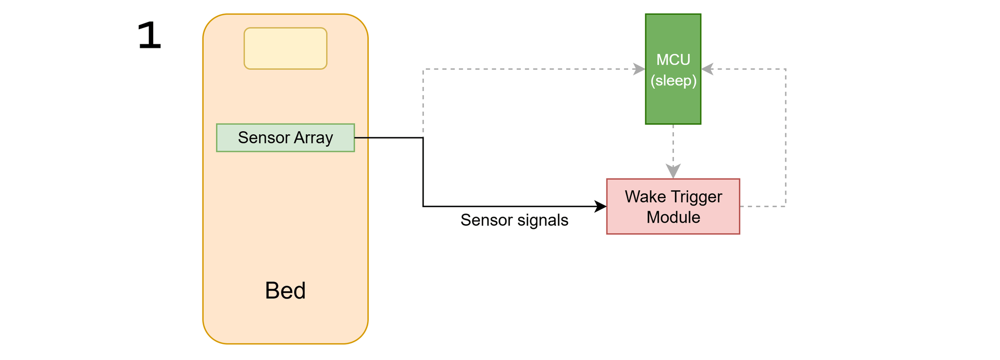
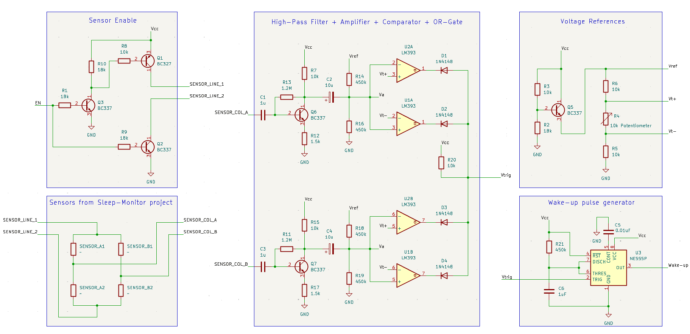

# Analog Wake Trigger – Low‑Power Motion Detector for the *sleep-monitor* Project

A compact analog module that monitors the velostat pressure sensors used in the **sleep-monitor** project and generates a clean digital wake signal whenever movement is detected.  
Although designed specifically for integration with [antonio-mariano/sleep-monitor](https://github.com/antonio-mariano/sleep-monitor), the module can also be used in similar systems or as a standalone movement detector.

This README focuses on circuit assembly, usage, and integration.  
A detailed explanation of the circuit architecture, design rationale, and the analog techniques behind it is available at:
👉 [docs/design_notes.md](https://github.com/antonio-mariano/analog-wake-trigger/blob/main/docs/design_notes.md)

---

## 📌 Overview

In the original *sleep-monitor*, the microcontroller must stay awake to continuously read the sensors, which leads to high power consumption.  
The **analog-wake-trigger** solves this limitation by acting as a low‑power motion sentinel that consumes only **3 mA** while continuously monitoring the sensors.

This allows the microcontroller (MCU) to remain in deep‑sleep mode and wake only when relevant motion occurs.

High‑level operation:

- 1 - The module continuously monitors the velostat sensors.
- 2 - When movement is detected, it generates a pulse of 1 second (configurable).
- 3 - This pulse wakes the microcontroller, which performs a full sensor reading (as in the original *sleep-monitor*) and then returns to sleep.
- The microcontroller can temporarily place the velostat sensors in high impedance from the module so they can be read without interference.

---

## ✨ Features

- Compatible with both **3.3 V and 5 V** microcontrollers, allowing direct power from the MCU.
- **Low power consumption** (~3 mA), suitable for battery‑powered systems.
- **Generates a clean digital pulse** to wake a microcontroller from deep sleep.
- **Adjustable detection threshold** via potentiometer for sensitivity tuning.
- Designed as a **companion module** for the sleep-monitor project.
- Can also operate as a **standalone movement detector**, where the pulse simply indicates “movement detected”.

---

## 🧩 Components (BOM List)

The circuit was design no minimize component count and type whenever possible

- Velostat pressure sensor matrix from the [*sleep-monitor*](https://github.com/antonio-mariano/sleep-monitor) project (or any resistive sensors arranged in a 2×2 matrix)
- 5× BC337 (NPN) transistors  
- 1× BC327 (PNP) transistor  
- 2× LM393 comparators  
- 1× NE555 timer

- 2x 1.5kOhm resistors
- 8x 10kOhm resistors
- 4x 18kOhm resistors
- 4x 450kOhm resistors
- 2x 1.2 MOhm resistors
- 1x 10k Potentiometer

- 1x 0.01 uF capacitor
- 3x 1uF capacitor
- 2x 10 uF capacitor

- 4x 1N4148 diode

---

## 🔌 Circuit Assembly

The module is composed of several analog stages that process the velostat signals and generate a clean digital wake pulse.  
These stages include filtering, amplification, threshold detection, and monostable pulse generation.

A complete schematic (KiCad + PDF) is available in the `/hardware` directory.  
LTspice simulations and waveforms are available in `/hardware/ltspice
